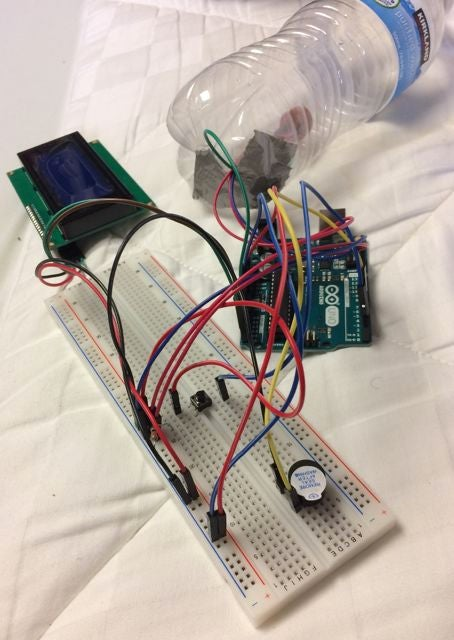
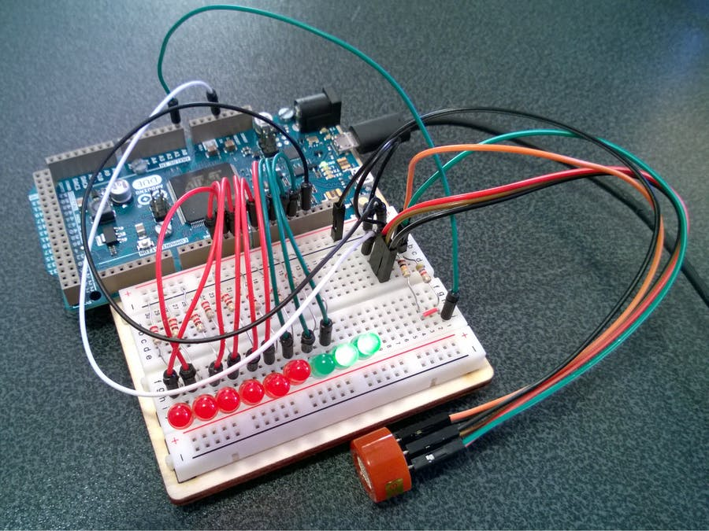
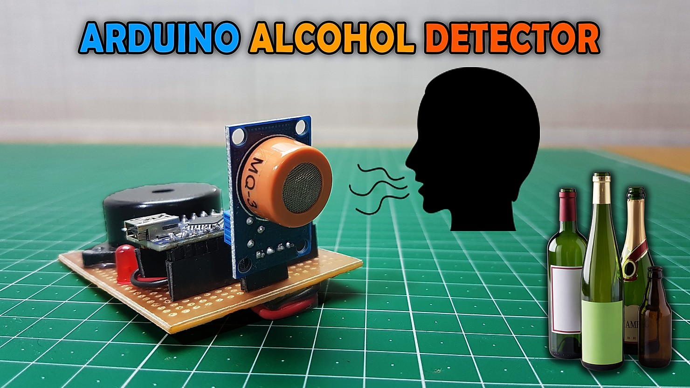
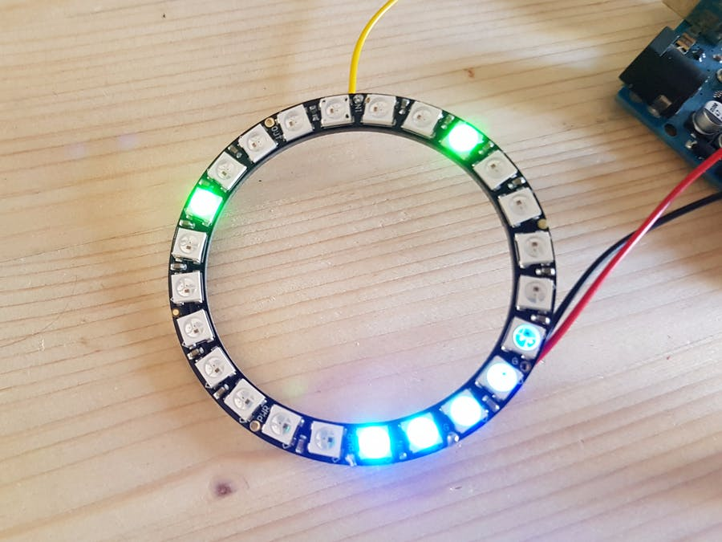
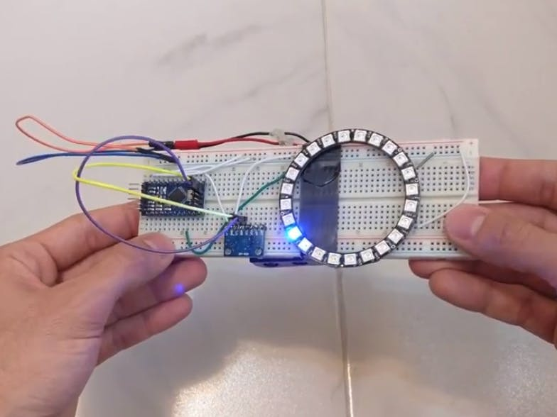
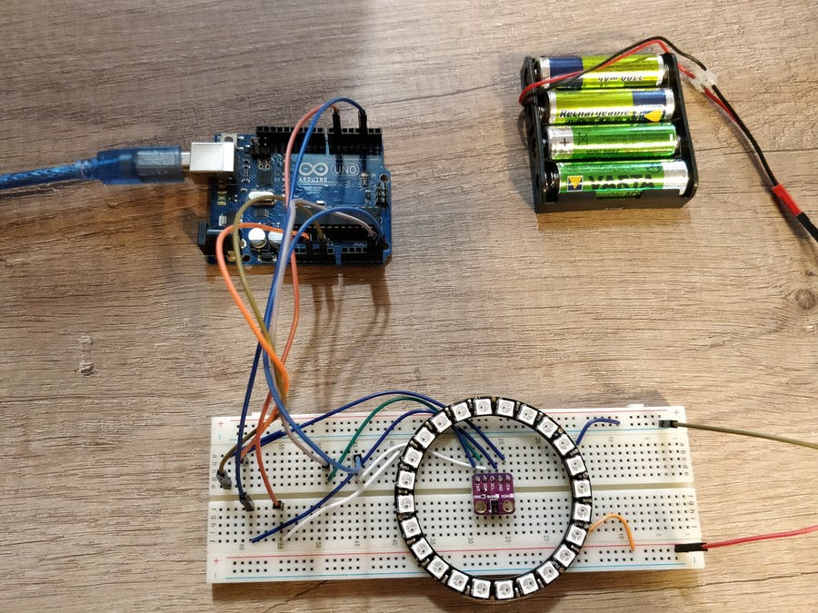
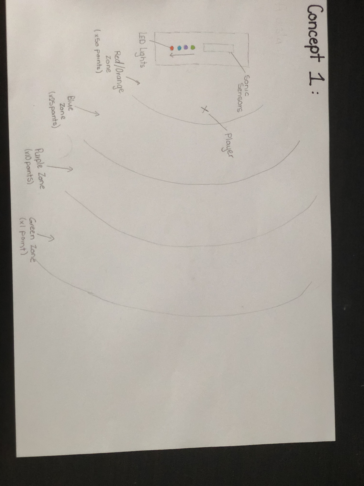
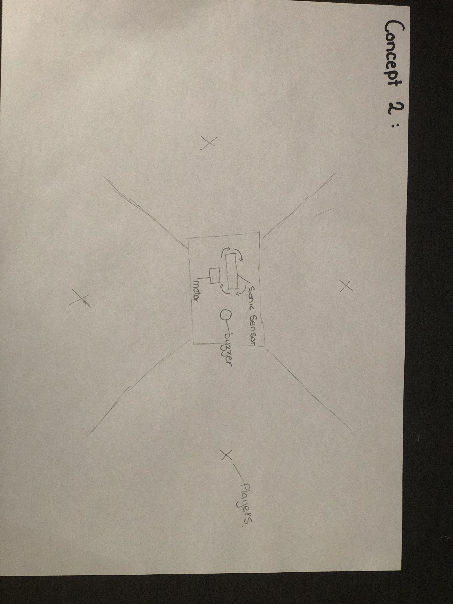
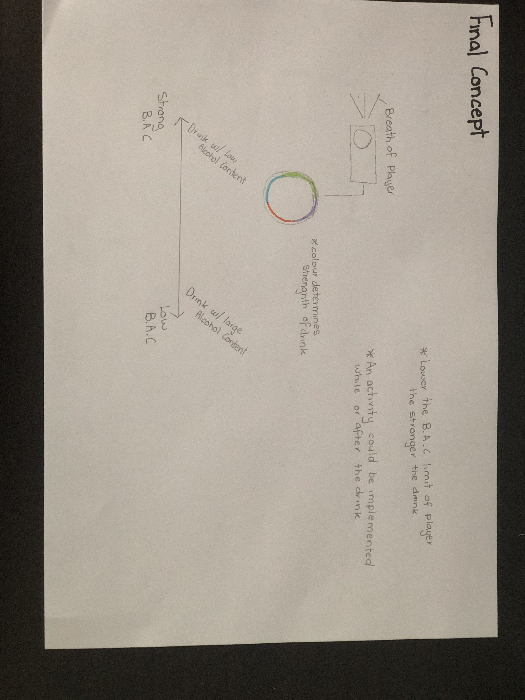

# 1701QCA Making Interaction - Assessment 2 workbook

## Breathalyser Game ##

## Related projects ##

### MQ-3 Arduino Alcohol Sensor ###

https://www.instructables.com/id/MQ-3-Arduino-Alcohol-Sensor/

The alcohol sensor project is using the same type of alcohol sesnor that is required for my design. This project helps me to understand how the to connect the MQ-3 to the micro:Bit. This project was used to help me understand the basics of the MQ-3 sensor and helped me get a better grasp on how to code with it.

### AAn alcohol tester with LED lights made with Zerynth ###

https://create.arduino.cc/projecthub/framan/an-alcohol-tester-with-led-lights-made-with-zerynth-fc9d9e?ref=search&ref_id=Alcohol%20sensor&offset=2

This project is similar to mine as it uses an MQ-3 Alcohol Sensor and connects it to sereis of LED lights. This has a similar design as to what I want to complete just with a alternative purpose. From this project was the basis of my idea of using LED lights, and helped me understand how to code them to react with the MQ-3 Acohol sensor.

### Arduino Alcohol Detector | MQ-3 Sensor ###

https://www.viralsciencecreativity.com/post/arduino-alcohol-detector-mq-3-sensor

The Arduino Alcohol Detector | MQ-3 Sensor project uses a MQ-3 Sensor and when over the set limiot the buzzer will go off. This is related to my project as it has the basis of when a certain B.A.C limit is reached it casues a reaction from an external device. This design allows me to veiw the etireity of the process that was required to make this and allows me to veiw the code.

### RING PONG ###

https://create.arduino.cc/projecthub/aerodynamics/ring-pong-b91a4f?ref=search&ref_id=RGB%20Ring&offset=0

This project created a game using the RGB Ring LED. This project is related to mie as it uses a RGB Ring LED which is what intented to be used in my project. This design allows me to understand the programming aspect and how to connect the Ring Light onto the micro:Bit.

### Gyroscope Fun with NeoPixel Ring ###

https://create.arduino.cc/projecthub/danionescu/gyroscope-fun-with-neopixel-ring-3a0b84?ref=search&ref_id=RGB%20Ring&offset=9

The Gyroscope project is related to this project as it uses readings from an external component then uses this reading and causes it to have a reaction with the Ring Light. This allows me to understand how to correctly connect and external device correctly.

### NeoPixel Animation with Gestures ###

https://create.arduino.cc/projecthub/danionescu/neopixel-animation-with-gestures-6322bf?ref=search&ref_id=RGB%20Ring&offset=19

The Geopixel Animation design project has similar factors to the current project underway. The project uses the same RGB Ring Light, and has a similar function of using reading from an external device to cause an action with the Ring Light. This allows me to understand the more complexe coding of the Ring light.

## Other research ##

### MQ-3 Alcohol Gas Sensor ###

https://components101.com/sensors/mq-3-alcohol-gas-sensor

This webpage was used to understand how to correctly wire the MQ-3 Sensor, and what each output on the sesnor is connected too.

### Learn Python - Full Course for Beginners [Tutorial] ###

https://www.youtube.com/watch?v=rfscVS0vtbw

This video was used to help learning how to program in python.

### Using an 24 Bit RGB Neopixel LCD Ring with Arduino ###

https://www.youtube.com/watch?v=ep82zvielUE

This video was used in the process of lighting up the RGB Ring Light as to understand the fundamental basics of operating the device.

## Conceptual progress ##

### Design intent ###
To create a mature social game that allows players to interact using a sensor.

### Design Concept 1 ###

A game that uses a sonic sesnor that is connected to a series of LED Lights.

This game involves a series of players or a single player to approach the sensor and try to get the greatest amounts of points. The points are determined by what colour light is lit by the sensor. 

The sonic sensor would be set on a timer and every 20 seconds it would read where the player is and light up the equivilant light.

This would repeat with each player.

### Design Concept 2 ###

A game that connects a movement sensor to a motor that rotates the sensor and when movement is detected a buzzer goes off.

This game can be played individually or with others.  The players are given a series of tasks (ie. twister, hopscotch, truth or dare etc.) and when the movement sensor is in their sector they all must freeze, no matter what position they are in. If the sensor detects movement the buzzer will sound and the team will either have a disadvantage next round or be out (it is ultimatley up to the players how they wish to use the equipment and what the rules are).

### Final Design Concept ###

A drinking game where each player breathes on an alcohol sensor, the sesnor then relays the level to a ring light that lights a certain colour (determined by the B.A.C) this colour determines what the strength of the next drink is.

This is a group game. At each turn the player uses the the Alcohol Sensor, once the level of B.A.C in their breath has been determined the player will drink the required drink and then complete a random activity (this can be determined by the colour or a alternative way). Once their turn is up the next player goes.

The type of alchol each colour represents is determined by the players, but the game is designed that as the B.A.C increases the Alcohol Content in the drink selected will decrease. 

This game will be using a MQ-3 Alcohol Sensor and 24 RGB LED Ring Module.

The game will be played off of a similar layout of a dartboard. This is so that the players can record what drinks each colour is for and for the activity points. This layout will also be a kind of box with a removable back, all the wires for this game will be run through the back of the board, this is due to the fact that this is a drinking game and if alcohol came in contact with the electronics the game would break. The removable back is so that the batteries are easily changed if they go flat.

### Interaction flowchart ###
*Draw a draft flowchart of what you anticipate the interaction process in your project to be. Make sure you think about all the stages of interaction step-by-step. Also make sure that you consider actions a user might take that aren't what you intend in an ideal use case. Insert an image of it below. It might just be a photo of a hand-drawn sketch, not a carefully drawn digital diagram. It just needs to be legible.*

## Physical experimentation documentation ##

*In this section, show your progress including whichever of the following are appropriate for your project at this point.
a.	Technical development. Could be code screenshots, pictures of electronics and hardware testing, video of tests. 
b.	Fabrication. Physical models, rough prototypes, sketches, diagrams of form, material considerations, mood boards, etc.
Ensure you include comments about the choices you've made along the way.*

*You will probably have a range of images and screenshots. Any test videos should be uploaded to YouTube or other publicly accessible site and a link provided here.*

## Design process discussion ##
*Discuss your process in getting to this point, particularly with reference to aspects of the Double Diamond design methodology or other relevant design process.*

## Next steps ##
The next steps for this project are working to get the ring light correctly connected and collaborated into the breathalyser system. After testing to make sure all parts of the system are working correctly, the fabrication of the box design where will begin. Once complete the electronics will temporarily placed within the box to make sure the equipment still work as intended in a alternate setup, once all electronics are working correcly the wires will be permantly intergrated into the design. 

Testing will begin once all electronics are permanently placed in the design,
