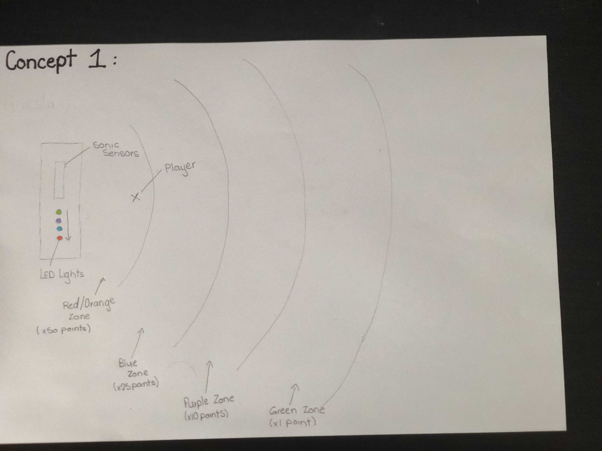

# 1701QCA Making Interaction - Assessment 2 workbook

## Breathalyser Game ##

## Related projects ##

### MQ-3 Arduino Alcohol Sensor ###

https://www.instructables.com/id/MQ-3-Arduino-Alcohol-Sensor/

The alcohol sensor project is using the same type of alcohol sesnor that is required for my design. This project helps me to understand how the to connect the MQ-3 to the micro:Bit. This project was used to help me understand the basics of the MQ-3 sensor and helped me get a better grasp on how to code with it.

### AAn alcohol tester with LED lights made with Zerynth ###

https://create.arduino.cc/projecthub/framan/an-alcohol-tester-with-led-lights-made-with-zerynth-fc9d9e?ref=search&ref_id=Alcohol%20sensor&offset=2

This project is similar to mine as it uses an MQ-3 Alcohol Sensor and connects it to sereis of LED lights. This has a similar design as to what I want to complete just with a alternative purpose. From this project was the basis of my idea of using LED lights, and helped me understand how to code them to react with the MQ-3 Acohol sensor.

### Arduino Alcohol Detector | MQ-3 Sensor ###

https://www.viralsciencecreativity.com/post/arduino-alcohol-detector-mq-3-sensor

The Arduino Alcohol Detector | MQ-3 Sensor project uses a MQ-3 Sensor and when over the set limiot the buzzer will go off. This is related to my project as it has the basis of when a certain B.A.C limit is reached it casues a reaction from an external device. This design allows me to veiw the etireity of the process that was required to make this and allows me to veiw the code.

### RING PONG ###

https://create.arduino.cc/projecthub/aerodynamics/ring-pong-b91a4f?ref=search&ref_id=RGB%20Ring&offset=0

This project created a game using the RGB Ring LED. This project is related to mie as it uses a RGB Ring LED which is what intented to be used in my project. This design allows me to understand the programming aspect and how to connect the Ring Light onto the micro:Bit.

### Gyroscope Fun with NeoPixel Ring ###

https://create.arduino.cc/projecthub/danionescu/gyroscope-fun-with-neopixel-ring-3a0b84?ref=search&ref_id=RGB%20Ring&offset=9

The Gyroscope project is related to this project as it uses readings from an external component then uses this reading and causes it to have a reaction with the Ring Light. This allows me to understand how to correctly connect and external device correctly.

### NeoPixel Animation with Gestures ###

https://create.arduino.cc/projecthub/danionescu/neopixel-animation-with-gestures-6322bf?ref=search&ref_id=RGB%20Ring&offset=19

The Geopixel Animation design project has similar factors to the current project underway. The project uses the same RGB Ring Light, and has a similar function of using reading from an external device to cause an action with the Ring Light. This allows me to understand the more complexe coding of the Ring light.

## Other research ##

### MQ-3 Alcohol Gas Sensor###

https://components101.com/sensors/mq-3-alcohol-gas-sensor

This webpage was used to understand how to correctly wire the MQ-3 Sensor, and what each output on the sesnor is connected too.

### Introduction to Arduino Programming I: Basics ###

https://www.youtube.com/watch?v=nigO-l-RQ3E

This video was used as a introduction into programming using Arduino

### Using an 24 Bit RGB Neopixel LCD Ring with Arduino ###

https://www.youtube.com/watch?v=ep82zvielUE

This video was used in the process of lighting up the RGB Ring Light as to understadn the fundamental basic of operating the device.

## Conceptual progress ##

### Design intent ###
To create a mature social game that allows players to interact using a sensor.

### Design Concept 1 ###

A game that uses a sonic sesnor that is connected to a series of LED Lights.

This game involves a series of players or a single player to approach the sensor and try to get the greatest amounts of points. The points are determined by what colour light is lit by the sensor. 

The sonic sensor would be set on a timer and every 20 seconds it would read where the player is and light up the equivilant light.

This would repeat with each player.

### Design Concept 2 ###

A game that connects 

### Final design concept ###
*This more fully developed concept should includ
e consideration of the interaction scheme, technical functionality, fabrication approach, materials to be used, and aesthetic.*

### Interaction flowchart ###
*Draw a draft flowchart of what you anticipate the interaction process in your project to be. Make sure you think about all the stages of interaction step-by-step. Also make sure that you consider actions a user might take that aren't what you intend in an ideal use case. Insert an image of it below. It might just be a photo of a hand-drawn sketch, not a carefully drawn digital diagram. It just needs to be legible.*

## Physical experimentation documentation ##

*In this section, show your progress including whichever of the following are appropriate for your project at this point.
a.	Technical development. Could be code screenshots, pictures of electronics and hardware testing, video of tests. 
b.	Fabrication. Physical models, rough prototypes, sketches, diagrams of form, material considerations, mood boards, etc.
Ensure you include comments about the choices you've made along the way.*

*You will probably have a range of images and screenshots. Any test videos should be uploaded to YouTube or other publicly accessible site and a link provided here.*

## Design process discussion ##
*Discuss your process in getting to this point, particularly with reference to aspects of the Double Diamond design methodology or other relevant design process.*

## Next steps ##
1. Intergrate Ring Light into device
2. Testing
3. Design a prototype that intergrates all components into a small portable game
4. Testing
5. Build design
6. Final Testing
